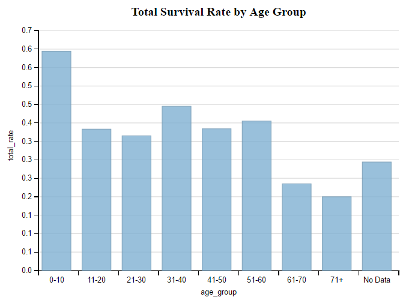
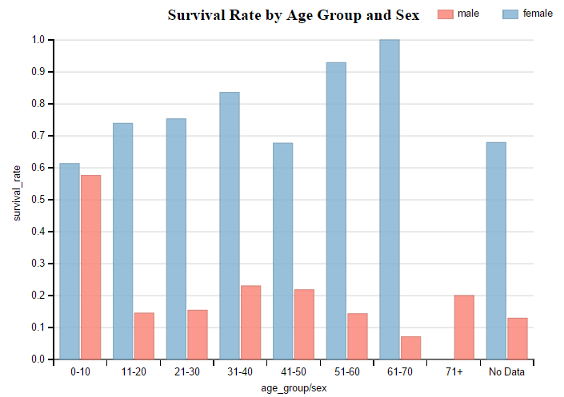
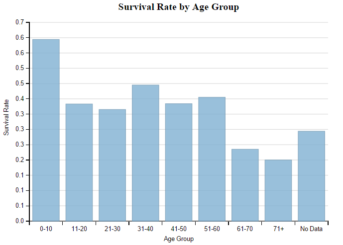
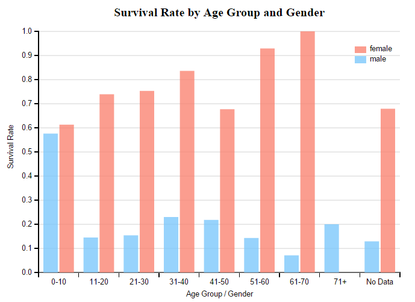
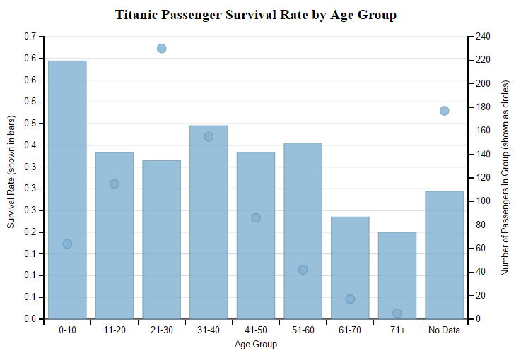
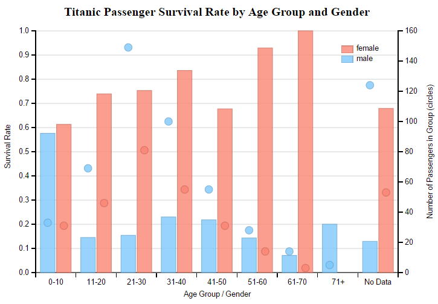

## Udacity Data Visualization Final Project

### (please test review with Chrome, for some reason Firefox do not display the full chart, or the title and legend can be misaligned)

### Titanic Passenger Survival Rate Data Visualization

#### Summary

It is general understanding that in the Titanic accident, the female passengers, children and elderly were receiving priority to get on board of the lifeboats and thus should have a better survival chances. The charts in this project is try to put data into visual display of these understandings.

This data visualization provides two charts to present the survival rates of the passengers on different age groups and gender of Titanic incident. 

1. **Titanic Passenger Survival Rate by Age Group**
```
  x-axis: age groups 
	left y-axis: survival rate of age group (irrespective of gender)
	right y-axis: passenger counts in age group (irrespective of gender)
```
2. **Titanic Passenger Survival Rate by Age Group and Gender**
```
  x-axis: age groups and gender
	left y-axis: survival rate of age group
	right y-axis: passenger counts in age group
```
In both chart, the survival rate data points are represented by the bars, and the passenger counts data points are represented by the circles, respectively.

For the purpose of data visualization in this project, only the following fields from the original dataset were used,
```    
    PassengerId
    Survived
    Sex
    Age
```
#### Data Source

Udacity Data Visualization "Data Set Options" - [Titanic Data](https://docs.google.com/document/d/1w7KhqotVi5eoKE3I_AZHbsxdr-NmcWsLTIiZrpxWx4w/pub?embedded=true)

This data set contains demographics and passenger information from a subset (891) of the 2224 passengers and crew on board the Titanic. More information about the data set[ can be found here](https://www.kaggle.com/c/titanic-gettingStarted). The data set is included in the project submission in folder ./data, and the description is provided in appendix A.

For the purpose of data visualization in this project, only the following fields were used,
```
    PassengerId
    Survived
    Sex
    Age
```

Further details of the data extraction will be discussed in the data file preparation section.

#### Data File Preparation

Two summary grouped data file (./data/titanic_survival_rate.csv and ./data/titanic_survival_by_age_gender.csv) in comma delimited format was prepared with the following fields(detail of how it’s created is outlined in Appendix B),

titanic_survival_rate.csv:

	age_group, passengers, survival_rate, male_rate, female_rate

titanic_survival_by_age_gender.csv:
```
    age_group
    sex
    passengers
    survived
    survival_rate
    age_group_passengers
    age_group_survived
    age_group_survival_rate
```

#### Data Visualization

Data visualization was implemented with dimple. Feedbacks were obtained from co-workers for presentation enhancements.

##### Initial Data Visualization





Feedback#1

The title on the first charts does not need to say "Total", and the axis description may be better not using the column names with underscores, it probably is better be a natural language. I do like that the actual rate is shown when the cursor is placed on the bars and a line is projected to the axes.

Feedback#2

On the second chart, the legend probably can be moved away from the title, the right top corner or left top corner may be a good place. Also the colors of the bars is better be reversed, with the female in pink and male in blue, that would be more intuitive for viewers to tell which one is male and which one is female even without looking at the legend, since pink is more a feminine color in general.

##### 2nd Data Visualization

Based on the feedbacks, the following changes were made (titanic_v1.js),

**Chart 1:**

        svg3.append("text")
         .attr("x", chart._xPixels() + chart._widthPixels() / 2)
         .attr("y", chart._yPixels() - 20)
         .style("text-anchor", "middle")
         .style("font-weight", "bold")
         .text("Survival Rate by Age Group");**

**        x.titleShape.text("Age Group");**
**        y.titleShape.text("Survival Rate");**

**Chart 2:**

	// assigning colors: female-pink, male-light blue**

**      chart.assignColor("female", "#FA8573", .75);**

**chart.assignColor("male", "#7EC8FC", .75);**

      svg4.append("text")
         .attr("x", chart._xPixels() + chart._widthPixels() / 2)
         .attr("y", chart._yPixels() - 20)
         .style("text-anchor", "middle")
         .style("font-weight", "bold")
**         .text("Survival Rate by Age Group and Gender");**

**    	chart.addLegend(width-120, 60, 100, 90, "left");**
        x.titleShape.text("Age Group / Gender");
        y.titleShape.text("Survival Rate");





Feedback#3

Showing the survival rates is fine, it does show the female has a higher survival rate than the male in general, but i like to see how many passengers were there. Statistically speaking, if some age groups or gender group has only a few passengers, then the rate may not mean much.

##### Final Data Visualization

Based on the feedback#3, the following changes were made (titanic_final.js),

// create two y-axis
// one for survival rate, one for passengers in group 
//   (age_group and gender)

y1 = chart.addMeasureAxis("y", "survival_rate");
y2 = chart.addMeasureAxis("y", "passengers");

// create two plots in one chart
s1 = chart.addSeries(["survival_rate", "sex"], dimple.plot.bar, [x, y1]);
s2 = chart.addSeries(["passengers", "sex"], dimple.plot.bubble, [x, y2]);

// 	reset title text on axes
x.titleShape.text("Age Group / Gender");
y1.titleShape.text("Survival Rate (shown in bars)");
y2.titleShape.text("Number of Passengers in Group (shown as circles)");

**Final charts**
1. Titanic Passenger Survival Rate by Age Group
2. Titanic Passenger Survival Rate by Age Group and Gender





Data Visualization Observations:
( note that the followings are just visual observations, not a strict statistical analysis )

Based on the final charts (ignoring the age group "No Data" that the group with no age information provided): 

Chart 1: Titanic Passenger Survival Rate by Age Group

1. the overall survival rate (around 0.4, or 40%) was quite even among different age groups (age 11 - 60) except for the 
2. The youngest age_group (0-10) had the highest survival rate of nearly 0.6.
3. The age groups above 61 actually showed a significant drop in survival rate. However, there were only 22 passengers with age above 60. It is hard to make such conclusion with low number of passenger counts.

Chart 2: Titanic Passenger Survival Rate by Age Group and Gender

1. It is easy to note that the female has a much higher survival rate in any age group.
2. The age group (0-10) shows that the male and female survival rate was about even.
3. The female age groups above 61 actually showed a significant rise in survival rate. However, with the same argument, there were only 17 female passengers with age above 60. It is hard to make such conclusion with low number of passenger counts.

#### Appendix A: Description of Titanic Dataset

File description: (ref: [https://www.kaggle.com/c/titanic/data](https://www.kaggle.com/c/titanic/data) )

VARIABLE DESCRIPTIONS:
survival        Survival			(0 = No; 1 = Yes)
pclass          Passenger Class	(1 = 1st; 2 = 2nd; 3 = 3rd)
name            Name
sex             Sex
age             Age
sibsp           Number of Siblings/Spouses Aboard
parch           Number of Parents/Children Aboard
ticket          Ticket Number
fare            Passenger Fare
cabin           Cabin
embarked        Port of Embarkation (C=Cherbourg; Q=Queenstown; S=Southampton)

SPECIAL NOTES:
Pclass is a proxy for socio-economic status (SES)
 1st ~ Upper; 2nd ~ Middle; 3rd ~ Lower

Age is in Years; Fractional if Age less than One (1)
 If the Age is Estimated, it is in the form xx.5

With respect to the family relation variables (i.e. sibsp and parch)
some relations were ignored.  The following are the definitions used
for sibsp and parch.

Sibling:  Brother, Sister, Stepbrother, or Stepsister of Passenger Aboard Titanic
Spouse:   Husband or Wife of Passenger Aboard Titanic (Mistresses and Fiances Ignored)
Parent:   Mother or Father of Passenger Aboard Titanic
Child:    Son, Daughter, Stepson, or Stepdaughter of Passenger Aboard Titanic

Other family relatives excluded from this study include cousins, nephews/nieces, aunts/uncles, and in-laws.  Some children travelled only with a nanny, therefore parch=0 for them.  As well, some
travelled with very close friends or neighbors in a village, however, the definitions do not support such relations.

The data used in this project consists of 891 observations of passengers aboard the Titanic. It is important to note that not all passengers aboard the ship are accounted for in this analysis. The information provided for each passenger includes age, sex, passenger class, and whether or not the passenger survived or died in the shipwreck. 

#### Appendix B: Preparation of summary data

( SQL script provided in ./sql/generate_summary.sql )

##### titanic_survival_by_age_gender.csv:

Original Titanic Data file titanic_data.csv was loaded into a Oracle database table.

A query was run and a comma delimited data file was generated.

select age_group, sex, 

        passengers,

        survived, 

        round(survived/passengers,3) survival_rate,

        age_group_passengers,

        age_group_survived,

        round(age_group_survived/age_group_passengers,3) age_group_survival_rate

  from (

select age_group, sex, survived, passengers,

       sum(passengers) over (partition by age_group) age_group_passengers,

       sum(survived) over (partition by age_group) age_group_survived

  from (

    select age_group,

           sex,

           count(*) passengers,

           sum(case when survived=1 then 1 else 0 end) survived

      from (

        select 

                case when age is null then 'No Data'

                    when age <= 10 then '0-10'

                    when age <= 20 then '11-20'

                    when age <= 30 then '21-30'

                    when age <= 40 then '31-40'

                    when age <= 50 then '41-50'

                    when age <= 60 then '51-60'

                    when age <= 70 then '61-70'

                    when age > 70 then '70+'

                    else 'UNKNOWN' 

                end age_group,

                d.*

          from X_TITANIC_DATA d

          )

         group by age_group, sex

         )

     )

 order by age_group, sex ;

##### Titanic_survival_rate.csv:

select age_group, passengers,

       round((male_survived+female_survived)/passengers,3) survival_rate,

       round(male_survived/passengers,3)     male_rate,

       round(female_survived/passengers,3)   female_rate

  from (

select age_group, 

       count(*) passengers,

       sum(case when survived=1 and sex='male' then 1 else 0 end) male_survived,        

       sum(case when survived=1 and sex='female' then 1 else 0 end) female_survived        

  from (

    select 

            case when age is null then 'No Data'

                when age <= 10 then '0-10'

                when age <= 20 then '11-20'

                when age <= 30 then '21-30'

                when age <= 40 then '31-40'

                when age <= 50 then '41-50'

                when age <= 60 then '51-60'

                when age <= 70 then '61-70'

                when age > 70 then '70+'

                else 'UNKNOWN' 

            end age_group,

            d.*

      from X_TITANIC_DATA d

      )

     group by age_group

  );

#### References

* [dimple.js Documentation](http://dimplejs.org/)

* [Data Visualization and D3.js (Udacity)](https://www.udacity.com/course/viewer#!/c-ud507-nd)

* [mbostock's blocks](http://bl.ocks.org/mbostock)

* [Dimple homepage](http://dimplejs.org/examples_viewer.html?id=bars_vertical_grouped)

* [http://jsfiddle.net/gcu2Y/](http://jsfiddle.net/gcu2Y/)

* [http://stackoverflow.com/questions/23291200/dimple-js-how-can-i-change-the-labels-of-a-chart-axis-without-changing-the-data](http://stackoverflow.com/questions/23291200/dimple-js-how-can-i-change-the-labels-of-a-chart-axis-without-changing-the-data)

* Titanic Data: [https://docs.google.com/document/d/1w7KhqotVi5eoKE3I_AZHbsxdr-NmcWsLTIiZrpxWx4w/pub?embedded=true](https://docs.google.com/document/d/1w7KhqotVi5eoKE3I_AZHbsxdr-NmcWsLTIiZrpxWx4w/pub?embedded=true)

